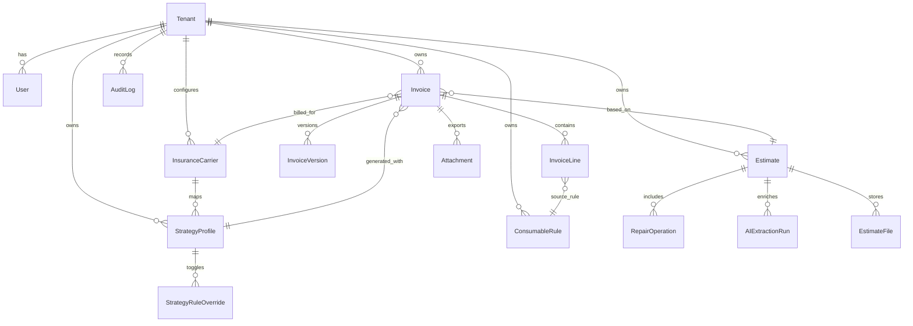

# 03 - Data Model (ER + Table Design)

## ER Diagram (MVP Core)

## Data Design Principles

- `tenant_id` on every business row for strict isolation
- immutable snapshots for parsed payload and AI extraction outputs
- versioned invoice edits for auditability and rollback support
- flexible JSON columns for evolving parser and AI schemas

## Tables (MVP)

- `tenants`
- `users`
- `insurance_carriers`
- `strategy_profiles`
- `consumable_rules`
- `strategy_rule_overrides`
- `estimates`
- `estimate_files`
- `repair_operations`
- `ai_extraction_runs`
- `invoices`
- `invoice_versions`
- `invoice_lines`
- `attachments`
- `audit_logs`

## Notes on Indexing

- Composite indexes for tenant-scoped filters:
  - `(tenant_id, created_at)`
  - `(tenant_id, status)`
  - `(tenant_id, invoice_number)`
- Search-friendly fields:
  - `estimates.claim_number`
  - `estimates.vin`
  - `invoices.invoice_number`

## Notes on Money and Units

- Monetary values stored as `Decimal(12,2)` in DB
- Quantities as `Decimal(10,3)` for consumable precision
- Each invoice line has explicit `unit` and `currency`
