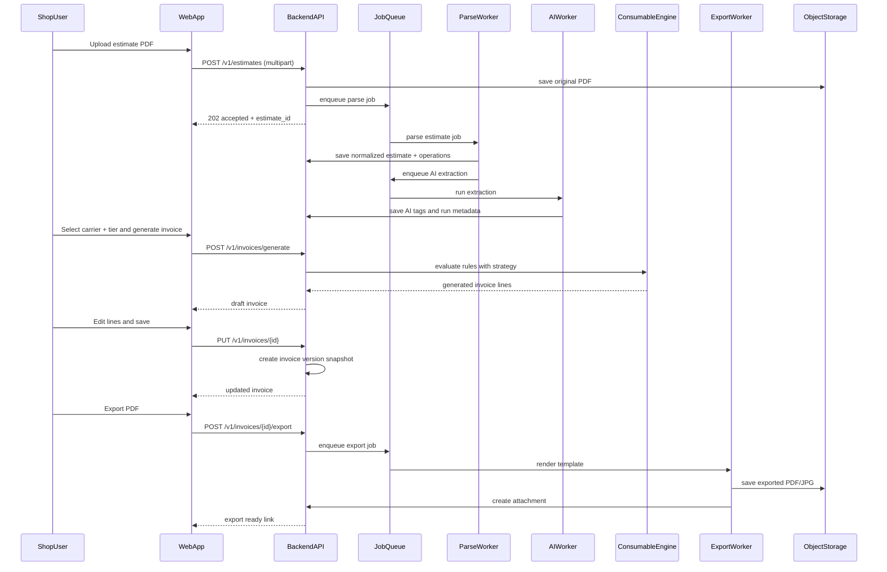

# 04 - Estimate to Invoice Flow and API Contract Notes

## End-to-End Sequence

## Status Transitions

### Estimate

- `UPLOADED` -> `PARSING` -> `PARSED`
- `UPLOADED` -> `PARSING` -> `FAILED`
- retry: `FAILED` -> `PARSING`

### Invoice

- `DRAFT` -> `APPROVED` -> `EXPORTED` -> `SUBMITTED` -> `SETTLED`
- adjustment path: `APPROVED` -> `DRAFT` (manager unlock)

## Contract Conventions

- Base path: `/v1`
- Auth: Bearer JWT
- Tenant scoping: resolved from token claims; server never trusts client-passed tenant id
- Idempotency:
  - `POST /invoices/generate` accepts `idempotency_key`
  - repeated key within tenant returns existing draft
- Error model:
  - `{ code, message, details, request_id }`

## Core Endpoint List

- `POST /v1/auth/login`
- `POST /v1/estimates`
- `GET /v1/estimates`
- `GET /v1/estimates/{estimate_id}`
- `POST /v1/estimates/{estimate_id}/retry-parse`
- `POST /v1/invoices/generate`
- `GET /v1/invoices`
- `GET /v1/invoices/{invoice_id}`
- `PUT /v1/invoices/{invoice_id}`
- `POST /v1/invoices/{invoice_id}/duplicate`
- `POST /v1/invoices/{invoice_id}/export`
- `GET /v1/invoices/{invoice_id}/attachments`

## Contract-Safe DTO Principles

- Use explicit decimal strings in payload for currency and qty
- Preserve provenance fields on generated lines:
  - `source_type`
  - `source_rule_id`
  - `source_operation_ref`
  - `source_metadata`
- Persist generation context:
  - `ruleset_version`
  - `ai_model`
  - `ai_prompt_version`
  - `strategy_profile_id`
